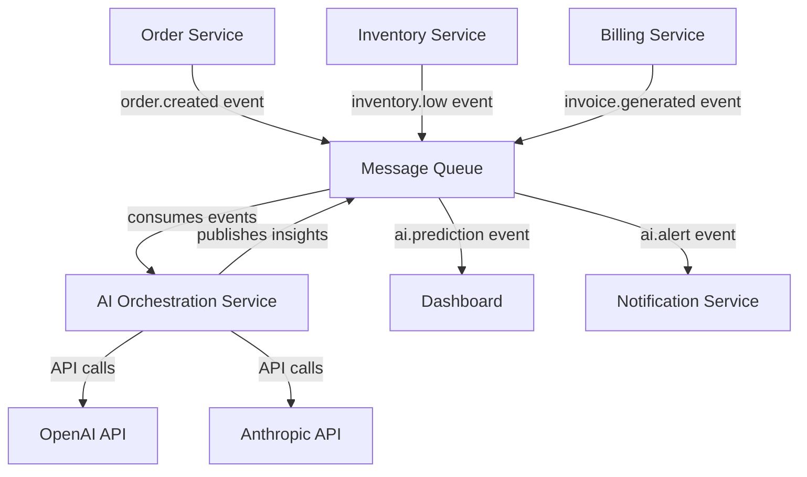

# 🤖 AI INTEGRATION STRATEGY - FIREMNÍ ASISTENT

**Status:** Strategic Priority - RELACE 24+  
**Last Updated:** 2025-08-02  
**Business Imperative:** Critical for 2025 market competitiveness

---

## 🚨 WHY AI INTEGRATION IS CRITICAL NOW

### **Market Reality 2025:**
- **$147.7B spending** on ERP software in 2025
- **30-40% efficiency gains** in AI-powered ERP systems
- **Strategic disadvantage** for non-AI systems within 3-5 years
- **Agentic AI** as the biggest ERP evolution driver

### **Competitive Landscape:**
- **SAP, Oracle, Microsoft, NetSuite** - massive AI investments
- **Small businesses** actively seeking alternatives with AI
- **Differentiation opportunity** for cloud-first + AI solutions

---

## 🏗️ AI ORCHESTRATION SERVICE ARCHITECTURE

### **Core Concept:**
Centrální AI služba která **neobsahuje AI modely**, ale orchestruje:
- External AI API calls (OpenAI, Anthropic, Google)
- Event-driven processing z ostatních služeb
- Cost monitoring & budget controls
- Prompt management & engineering

### **Service Architecture:**
```
┌─────────────────────────────────────────────────────────────┐
│                 AI ORCHESTRATION SERVICE                     │
├─────────────────────────────────────────────────────────────┤
│  Port: 3005                                                │
│  Database: ai_db (metadata, costs, results)                │
│  API: REST + Event-driven processing                       │
└─────────────────────────────────────────────────────────────┘
                              │
        ┌─────────────────────┼─────────────────────┐
        │                     │                     │
   ┌────▼────┐          ┌─────▼─────┐        ┌─────▼─────┐
   │ OpenAI  │          │ Anthropic │        │  Google   │
   │   API   │          │    API    │        │  AI API   │
   └─────────┘          └───────────┘        └───────────┘
```

### **Integration Flow:**


---

## 🎯 IMMEDIATE AI USE CASES (RELACE 24-26)

### **1. Smart Inventory Forecasting** (RELACE 24)
```javascript
// Event: order.created, inventory.updated
// AI Task: Predict future demand for SKUs
// Output: Reorder recommendations

{
  "event": "inventory.prediction",
  "item_id": "abc-123",
  "current_stock": 15,
  "predicted_demand_30d": 45,
  "recommended_reorder": 50,
  "confidence": 0.87,
  "reasoning": "Based on seasonal trends and recent order patterns"
}
```

### **2. Intelligent Cost Prediction** (RELACE 25)
```javascript
// Event: order.created
// AI Task: Predict project costs based on historical data
// Output: Cost estimates with confidence intervals

{
  "event": "cost.prediction",
  "order_id": "order-456",
  "estimated_material_cost": 1250.00,
  "estimated_labor_hours": 18.5,
  "total_estimated_cost": 2100.00,
  "confidence_range": [1800, 2400],
  "risk_factors": ["new_customer", "complex_requirements"]
}
```

### **3. Automated Invoice Generation** (RELACE 25)
```javascript
// Event: order.completed
// AI Task: Generate invoice description and validate items
// Output: AI-optimized invoice with smart descriptions

{
  "event": "invoice.ai_generated",
  "order_id": "order-456",
  "ai_description": "Kompletní grafické řešení včetně designu a instalace",
  "optimized_line_items": [
    {
      "description": "Profesionální grafický design - 8 hodin",
      "quantity": 8,
      "unit_price": 150.00
    }
  ],
  "payment_terms_suggestion": 14 // AI-recommended based on customer history
}
```

### **4. Predictive Maintenance Alerts** (RELACE 26)
```javascript
// Event: equipment.usage_logged
// AI Task: Predict maintenance needs
// Output: Proactive maintenance recommendations

{
  "event": "maintenance.prediction",
  "equipment_id": "printer-001",
  "predicted_maintenance_date": "2025-09-15",
  "maintenance_type": "routine_service",
  "estimated_cost": 350.00,
  "urgency": "medium",
  "reasoning": "Based on usage patterns, last service date, and manufacturer recommendations"
}
```

---

## 💰 COST MANAGEMENT & BUDGETING

### **AI API Cost Controls:**
```javascript
// Built-in cost monitoring
const AI_BUDGET_LIMITS = {
  daily_budget: 50.00,      // $50/day limit
  monthly_budget: 1000.00,  // $1000/month limit
  per_request_limit: 5.00,  // Max $5 per AI request
  emergency_stop: 100.00    // Emergency brake at $100/day
};

// Circuit breaker implementation
if (daily_spending > AI_BUDGET_LIMITS.daily_budget * 0.8) {
  // Switch to reduced AI functionality
  enableLimitedAIMode();
}
```

### **Cost-Effective Strategy:**
- **Start small** - basic prompts, essential features only
- **Monitor everything** - token usage, response times, costs
- **Gradual expansion** - add AI features based on ROI
- **Fallback modes** - system works without AI if needed

---

## 🔒 SECURITY & PRIVACY CONSIDERATIONS

### **Data Protection:**
```javascript
// Data anonymization before AI processing
function anonymizeBusinessData(orderData) {
  return {
    ...orderData,
    customer_name: "CUSTOMER_" + hashCustomerId(orderData.customer_id),
    customer_email: null, // Remove PII
    customer_address: null, // Remove PII
    // Keep business-relevant data only
    order_value: orderData.total_amount,
    items_count: orderData.items.length,
    order_complexity: calculateComplexity(orderData.items)
  };
}
```

### **Compliance Strategy:**
- **GDPR Compliance** - No personal data to AI without consent
- **Data Minimization** - Send only business-essential data
- **Audit Logging** - Track all AI requests and responses
- **User Transparency** - Clear communication about AI usage

---

## 🛠️ TECHNICAL IMPLEMENTATION ROADMAP

### **RELACE 24: AI Foundation** (Current Priority)
```bash
# Service Structure
services/ai-orchestration-service/
├── src/
│   ├── providers/
│   │   ├── openai-provider.js     # OpenAI integration
│   │   ├── anthropic-provider.js  # Anthropic integration
│   │   └── provider-factory.js    # Dynamic provider selection
│   ├── orchestrator/
│   │   ├── event-processor.js     # Process business events
│   │   ├── prompt-manager.js      # Manage AI prompts
│   │   └── response-handler.js    # Process AI responses
│   ├── monitoring/
│   │   ├── cost-monitor.js        # Track spending
│   │   ├── performance-monitor.js # Track response times
│   │   └── error-handler.js       # Handle AI failures
│   └── app.js                     # Main service entry
├── prompts/
│   ├── inventory-forecasting.txt  # Inventory AI prompts
│   ├── cost-prediction.txt        # Cost estimation prompts
│   └── invoice-generation.txt     # Invoice AI prompts
└── package.json
```

### **RELACE 25: First AI Features**
- Smart Inventory Forecasting implementation
- Cost Prediction for new orders
- AI-assisted invoice generation

### **RELACE 26: Advanced AI Features**
- Predictive maintenance
- Natural language business queries
- Advanced analytics with AI insights

---

## 📊 SUCCESS METRICS & KPIs

### **Technical Metrics:**
- **AI Response Time:** < 3 seconds for predictions
- **Cost Efficiency:** < $200/month AI spending
- **Accuracy Rate:** > 80% for predictions
- **System Uptime:** 99.9% with AI degradation fallbacks

### **Business Metrics:**
- **Inventory Optimization:** 20% reduction in overstock
- **Cost Prediction Accuracy:** 85% within 10% margin
- **Invoice Processing Speed:** 50% faster generation
- **User Satisfaction:** AI features rated > 4.0/5.0

---

## 🚀 COMPETITIVE ADVANTAGES

### **Differentiation from Giants (SAP, Oracle):**
- **Cost-Effective AI** - No enterprise licensing fees
- **SMB-Focused AI** - Tailored for small business needs
- **Transparent AI** - Clear explanations of AI decisions
- **Gradual Adoption** - Easy AI feature toggle on/off

### **Advantages over Current Alternatives:**
- **Modern Architecture** - Cloud-native AI integration
- **Real-time Processing** - Event-driven AI insights
- **Czech Market Focus** - Localized AI understanding
- **Open Architecture** - No vendor lock-in for AI providers

---

## ⚠️ RISKS & MITIGATION STRATEGIES

### **Technical Risks:**
| Risk | Probability | Impact | Mitigation |
|------|-------------|---------|------------|
| AI API Downtime | Medium | High | Multiple provider fallbacks |
| Cost Overrun | High | Medium | Strict budgeting + circuit breakers |
| Data Privacy Breach | Low | Critical | Data anonymization + audit logs |
| AI Inaccuracy | Medium | Medium | Confidence thresholds + human oversight |

### **Business Risks:**
| Risk | Probability | Impact | Mitigation |
|------|-------------|---------|------------|
| Market Timing | Low | High | Gradual rollout + user feedback |
| User Adoption | Medium | Medium | Clear value demonstration + training |
| Regulatory Changes | Low | High | Compliance monitoring + adaptability |

---

## 🎯 NEXT STEPS (IMMEDIATE ACTIONS)

### **Priority 1: Architecture Setup**
1. **Create AI Orchestration Service** basic structure
2. **Setup OpenAI integration** with cost monitoring
3. **Implement event processing** from existing services
4. **Create first AI prompt** for inventory forecasting

### **Priority 2: Business Logic Integration**
1. **Enhance existing services** to publish rich events
2. **Implement AI event consumption** in relevant services
3. **Create user interface** for AI insights
4. **Setup monitoring dashboards** for AI performance

### **Priority 3: Testing & Validation**
1. **Test AI accuracy** with historical data
2. **Validate cost controls** and budget limits
3. **User acceptance testing** for AI features
4. **Performance testing** under load

---

**CONCLUSION:** AI integration není pouze technický upgrade - je to strategická nutnost pro konkurenceschopnost v roce 2025. Implementace musí být systematická, cost-effective a user-focused.

---

## 📋 RELATED DOCUMENTATION

### Core AI Documents
- **[AI_SECURITY_GDPR_ANALYSIS.md](./docs/AI_SECURITY_GDPR_ANALYSIS.md)** - Kompletní GDPR & bezpečnostní analýza (2025-08-02)
- **[ARCHITECTURE.md](./ARCHITECTURE.md)** - AI Orchestration Service architektura 
- **[RELACE24_CONTINUATION_PROMPT.md](./RELACE24_CONTINUATION_PROMPT.md)** - AI priority v development roadmapu

### Quick Links
- AI Security Matrix → [AI_SECURITY_GDPR_ANALYSIS.md#role-based-access-matrix](./docs/AI_SECURITY_GDPR_ANALYSIS.md#role-based-access-matrix)
- GDPR Compliance → [AI_SECURITY_GDPR_ANALYSIS.md#gdpr-compliance-status](./docs/AI_SECURITY_GDPR_ANALYSIS.md#gdpr-compliance-status)  
- Implementation Roadmap → [AI_SECURITY_GDPR_ANALYSIS.md#implementation-roadmap](./docs/AI_SECURITY_GDPR_ANALYSIS.md#implementation-roadmap)

---

*AI Integration Strategy | Strategic Priority | Competitive Necessity for 2025*
*Security Analysis: ✅ Complete - 2025-08-02 | GDPR Compliance: ✅ Designed*